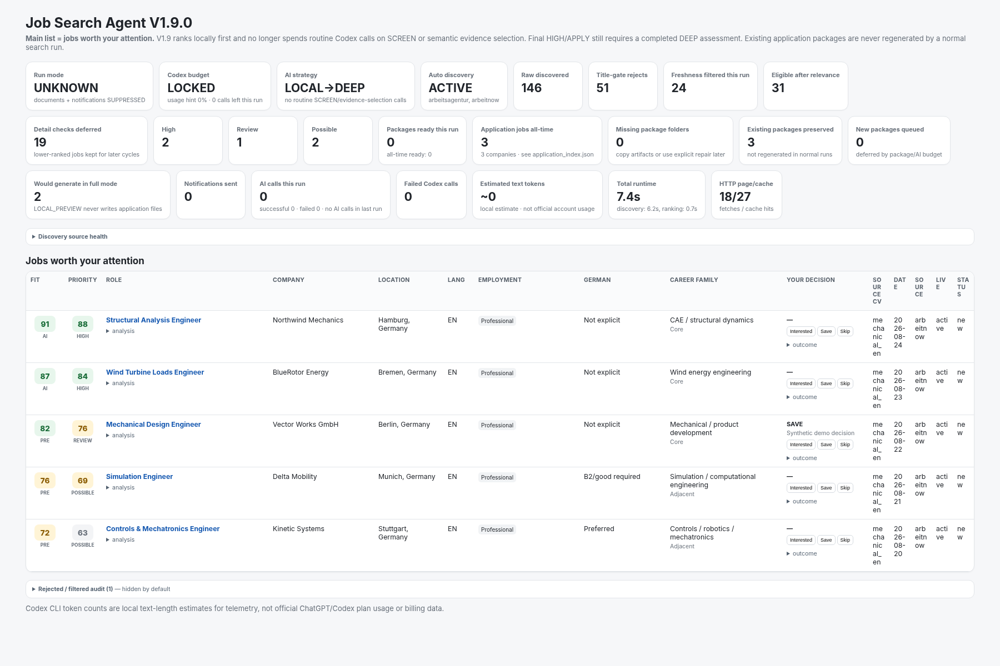
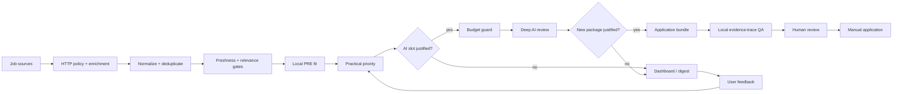

# Job Search Agent

A local-first Python workflow for discovering engineering jobs, ranking them against verified candidate evidence, and preparing reviewable application packages under explicit AI and network budgets.

The project is designed around a simple rule: **use deterministic local computation for discovery, filtering, ranking, and traceability; spend AI calls only when they can materially change a decision or create a new deliverable.** Applications are never submitted automatically.



## Why this project exists

Job search automation is easy to make noisy: duplicate listings, stale pages, irrelevant titles, repeated AI calls, and application text that drifts beyond the candidate's actual experience. This agent treats those as engineering constraints rather than prompt-writing problems.

The current architecture combines:

- multi-source job discovery with source-health reporting;
- URL canonicalization, deduplication, freshness rules, and live-page checks;
- deterministic relevance gates before expensive evaluation;
- evidence-grounded fit and application-priority scoring;
- optional AI deep review with hard per-run and cross-run resource limits;
- CV and cover-letter package generation with claim-to-evidence traceability;
- a local SQLite store, HTML dashboard, feedback loop, and application-state tracking;
- human review as the final gate before any application is sent.

## Architecture



More detail: [docs/ARCHITECTURE.md](docs/ARCHITECTURE.md).

## Key design decisions

### Local-first ranking

Routine execution does not require an AI screening call. The pipeline first applies deterministic title/domain relevance, local fit scoring, career-family logic, freshness, language constraints, and practical priority. This keeps discovery useful even when no AI provider is available.

### Evidence-grounded application generation

The repository maintains a verified evidence registry. Generated application content is expected to cite compatible evidence IDs, and a deterministic trace gate checks controlled claims before a package can be considered ready.

### Resource-governed AI

Provider usage is guarded before execution with independent limits for calls, estimated input size, failures, daily usage, and allowance-period usage. A cross-project ledger prevents copying the repository into a new folder from silently resetting local counters.

The public repository intentionally ships with provider work **locked** in `input/codex_usage_hint.json`. Local preview remains available without unlocking it.

### Human-controlled applications

The system prepares and ranks. It does **not** auto-submit applications. Existing application packages are preserved during normal runs, and regeneration requires an explicit repair path.

## Discovery sources

The source layer currently supports:

- Bundesagentur für Arbeit
- Arbeitnow
- Adzuna
- Jooble
- Greenhouse
- Lever
- SmartRecruiters
- manually supplied job URLs
- exported email-alert files

Availability depends on configuration, API credentials, and the source's current behavior. The `sources` command reports which connectors are operational before a run.

## Safe quick start

Requires Python 3.10+.

```bash
python -m venv .venv
# Linux/macOS
source .venv/bin/activate
# Windows PowerShell: .venv\Scripts\Activate.ps1

pip install -r requirements.txt
cp .env.example .env        # Windows: copy .env.example .env
python agent.py doctor
```

Run the default local preview:

```bash
python agent.py run
```

That path performs discovery, filtering, local ranking, dashboard generation, and digest generation without enabling provider work.

Other useful commands:

```bash
python agent.py sources
python agent.py dashboard
python agent.py digest
python agent.py serve
python agent.py feedback <job-id-or-url> SAVE --reason "review later"
```

### Optional full preparation

Only after reviewing `config.yaml`, configuring the desired provider, and updating your own usage hint:

```bash
python agent.py run --full
```

The full path remains subject to the configured AI budget guard and package limits.

## Configuration

Start with:

- `.env.example` for secrets/API credentials;
- `config.example.yaml` for search, ranking, provider, HTTP, document, and notification settings;
- `input/profile.json` and the sanitized CV templates for candidate evidence;
- `input/career_scope.yaml` for target/adjacent/stretch career families;
- `input/evidence/evidence.json` for verified claims used in traceability.

Never commit a populated `.env`, raw email alerts, generated application packages, or runtime databases. The repository's `.gitignore` excludes those by default.

## Tests and validation

The archived v1.9.0 release contains **87 automated regression tests** covering the core pipeline and version-specific safeguards.

```bash
python -m pytest -q
python -m compileall -q .
```

The test suite covers, among other things:

- deduplication and URL safety;
- ATS parsing regressions;
- relevance and language gates;
- discovery-source behavior;
- evidence selection and traceability;
- application-package recovery;
- AI budget reservation and failure circuit breaking;
- zero-provider local preview;
- preservation of existing application packages.

GitHub Actions runs the Python test suite on pushes and pull requests.

## Demo

The screenshot above is generated from **synthetic job data** so the repository can demonstrate the dashboard without publishing a real job-search database. Rebuild it with:

```bash
python scripts/build_demo_dashboard.py
```

See [docs/DEMO.md](docs/DEMO.md) for the demo flow and what each dashboard field represents.

## Repository map

```text
agent.py                     CLI entry point
src/pipeline.py              orchestration and run modes
src/sources/                 discovery connectors
src/http_policy.py           throttling, retries, cache, robots policy
src/relevance.py             deterministic relevance gate
src/filters.py               local fit / PRE scoring
src/priority.py              practical application priority
src/evidence.py              verified evidence retrieval
src/ai.py                    optional provider-backed deep review
src/ai_budget.py             provider resource guard + global ledger
src/documents.py             CV / cover-letter package generation
src/db.py                    SQLite state and migrations
src/dashboard.py             review dashboard
tests/                       regression suites by release family
input/                       sanitized candidate/configuration inputs
docs/                        architecture, demo, history, public audit
```

## Development history

This repository was reconstructed from 13 archived source snapshots ranging from v1.3 through v1.9.0. Each recoverable snapshot is represented by a commit and version tag. Two documented hotfix releases (`v1.7.1` and `v1.8.2-hotfix1`) did not have exact archived filesystem snapshots, so no fabricated tags were created for them.

The public history also applies narrowly scoped privacy sanitization to account-specific local paths and provider-usage state. Source-code changes are otherwise reconstructed from the archived snapshots.

See [docs/DEVELOPMENT_HISTORY.md](docs/DEVELOPMENT_HISTORY.md) for the verified release sequence and reconstruction policy.

Publishing instructions are in [docs/GITHUB_PUBLISH.md](docs/GITHUB_PUBLISH.md).

## Scope and limitations

This is a personal engineering project, not a hosted recruiting service. External job sources can change without notice, some connectors require credentials, and AI output still requires human review. Ranking is a decision-support mechanism rather than a guarantee of suitability or hiring outcome.

## License

No open-source license has been selected yet. Unless a license file is added, normal copyright restrictions apply.
