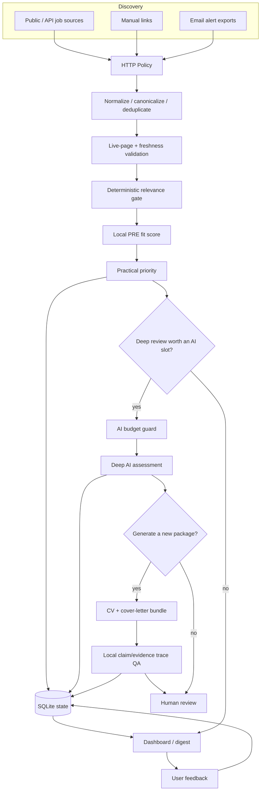

# Architecture

## Design goals

The system is organized around five constraints: discovery breadth, relevance before cost, evidence-grounded decisions, explicit resource budgets, and human control over final applications.



## Components

### Discovery connectors

`src/sources/` implements a common source interface for broad job sources, ATS endpoints, manual links, and email-alert exports. Source-health reporting separates “configured” from “actually operational”.

### HTTP policy

`src/http_policy.py` centralizes per-host delay, jitter, retry/backoff, cache behavior, URL safety, and robots.txt handling. Detail enrichment is capped and prioritized rather than accelerated by increasing request rate.

### Normalization and database state

`src/db.py` stores jobs, matches, applications, feedback, usage telemetry, and notification deduplication in SQLite. Canonicalized URLs and fingerprints reduce duplicates across sources.

### Relevance and PRE scoring

`src/relevance.py`, `src/filters.py`, and career-scope configuration reject clearly irrelevant job families before expensive evaluation. Local PRE scoring estimates technical, experience, language, education, and career-family fit.

### Practical priority

`src/priority.py` separates “fit” from “should I actually spend time applying?”. Priority can incorporate freshness, career tier, blockers, existing state, and user feedback.

### Evidence registry

`src/evidence.py` loads verified claims from `input/evidence/evidence.json`. This constrains what downstream AI/document generation may claim and enables deterministic trace checking.

### AI provider layer

`src/ai.py` supports explicit provider selection. Normal execution can remain heuristic/local. Provider work is only entered through explicit full-preparation paths.

### AI budget guard

`src/ai_budget.py` reserves budget before execution and maintains a cross-project attempt ledger. Limits cover per-run calls/input, failed calls, daily calls/input, and allowance-period calls/input. Ledger-write failure can block provider execution fail-closed.

### Document generation

`src/documents.py` produces tailored CV and cover-letter packages from sanitized templates. Normal runs preserve existing packages; regeneration is an explicit repair operation.

### Review UI

`src/dashboard.py` and `src/dashboard_server.py` provide a local HTML review surface with fit, priority, evidence, language requirements, status, feedback, and package state.

## Run modes

### Local preview

```text
Discovery -> local filtering -> local ranking -> dashboard/digest
```

No provider call and no application package generation.

### Full preparation

```text
Local preview -> globally rank deep candidates -> budget guard
              -> limited deep reviews -> limited new packages -> local trace QA
```

### Repair

Existing packages are only regenerated through an explicit repair command, preventing routine runs from repeatedly spending provider resources on old work.
